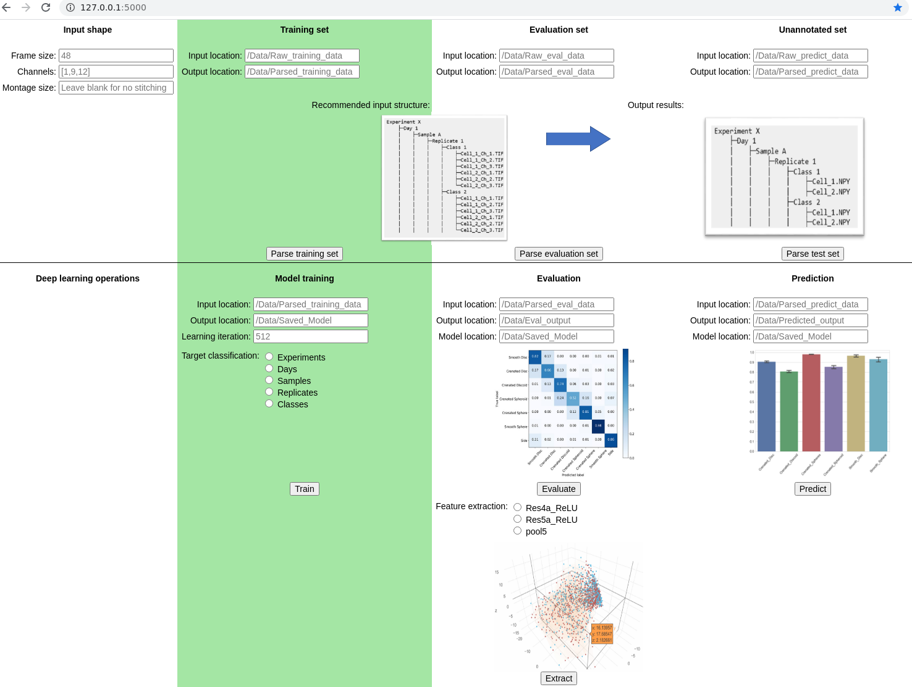
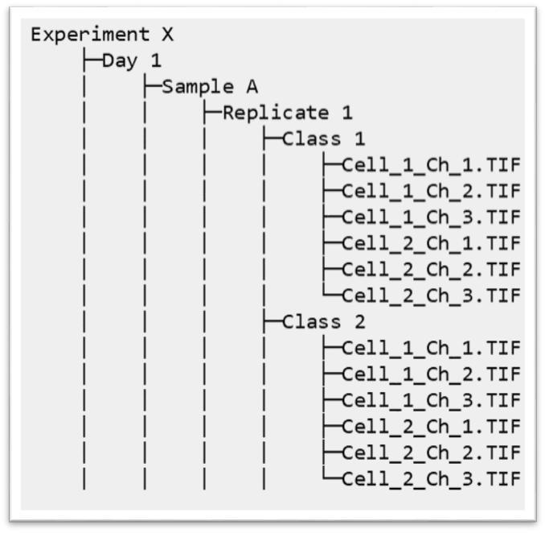
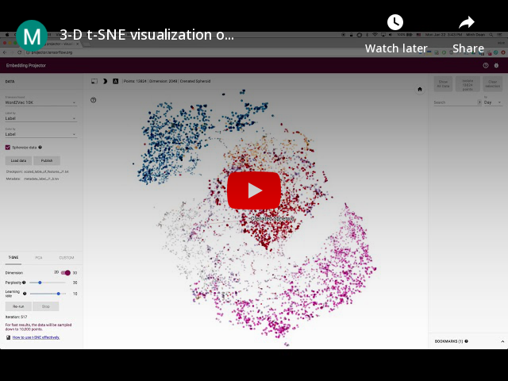

Deepometry
==========

Deep learning-based image classification and featurization for imaging (flow) cytometry.

This workflow was originally built for imaging flow cytometry data but can be readily adapted for microscopic images of isolated single objects. The modified implementation of ResNet50 allows researchers to use any image frame size and any number of color channels.

Installation
------------

A full installation guide can be found [here](https://www.evernote.com/shard/s730/sh/f60a69be-cb67-45f7-8054-c71035478b5e/5d7ca2a094dd33a599ef57715403cead). Briefly, the following dependencies are needed:
- Python 3.6
- Tensorflow-gpu 1.9.0
- Keras 2.1.5
- Numpy 1.18.1
- Scipy 1.4.1
- Keras-resnet 0.0.7
- Java JDK 8.0 or 11.0
- Python-bioformats 1.5.2

Once the above dependencies are installed, clone this ``Deepometry`` repository by :

    git clone https://github.com/broadinstitute/deepometry.git

    

Use
---
Execute ``Deepometry`` functions through either CLI (deepometry --help), [Jupyter notebook](https://github.com/broadinstitute/deepometry/tree/master/examples) or GUI (highly recommended):

    cd deepometry
    python Deepometry_GUI.py

Open a web-browser, navigate to **http://localhost:5000/** or **http://127.0.0.1:5000/**

(this is a local server running on your own device, no data is sent out to the internet)

1. **Parsing data:**

    Transform single-cell image data from .TIF, .CIF (gated populations exported from [IDEAS software](https://www.luminexcorp.com/imaging-flow-cytometry/)) to Numpy arrays (.NPY).

    Essential user inputs:
    - *Frame size*: set the width/height size of the (width × height × channel) tensor. If user sets a size bigger than the original images, each of the images will be padded with its own background. If user sets a size smaller than the original images, each of the images will be cropped toward its center.
    - *Channels*: choose the channel(s) imaged by the instrument (e.g. image flow cytometer, fluorescent microscopy). If a single channel is desired, input an integer. Use square brackets [ ] for multiple channels, e.g. [0,6,3,4]
    - *Input location*: choose the folder that contains original image inputs. **Note**: it is highly recommended to structure the input folder into hierarchical sub-folders tagged with *Experiment ...*, *Day ...*, *Sample ...*, *Replicate ...* , *Class ...*
    
    - *Output location*: location to store the parsed numpy arrays.

    - (Optional) *Montage size*: use this option to generate per-channel tiled (stitched) images. Stitched images are great inputs for [CellProfiler](http://cellprofiler.org/imagingflowcytometry/).

2. Model training

    Train a ResNet50 using Tensorflow backend.

    Essential user inputs:
    - *Input location*: choose the folder that contains parsed numpy arrays (from step 1).
    - *Output location*: location to store the trained model.
    - *Target classification*: choose the target categories to train the classifier, e.g. choose "Samples" to instruct the model to learn to categorize Sample A, Sample B, Sample C; choose "Classes" to train the model to distinguish "Class Control_cells", "Class Treated_cells" etc...
    - *Learning iteration*: the number of *epochs* for a deep learning training session. Be default it is set to 512, which might take several days (depends on the size of the training materials and available hardware, especially GPUs).
    - More (hyper)parameters for model training can be set at [model.fit](https://github.com/broadinstitute/deepometry/blob/6f41345f4ddff1cdb2acdfba427274ee03e865f1/deepometry/model.py#L106).

3. Evaluation

    Evaluate a trained model using annotated data.

    Essential user inputs:
    - *Input location*: choose the folder that contains parsed numpy arrays (from step 1).
    - *Output location*: location to store the evaluation outcomes.
    - *Target classification*: choose the target categories to test the classifier.
    - *Input location* **of the model training session**: choose the folder that contains parsed numpy arrays (from step 1). This is crucial to ensure the correct reconstruction of categorization, since the training materials should contain all the categories the model has been taught to classify, e.g. there could be a situation that one or some categories are missing in a testing dataset.
    - (Optional) *Model location*: location of the saved model. Input either a folder location or an exact .h5 or .hdf5 file. If the provided folder location contains more than one model, the latest .h5 or .hdf5 will be loaded. If no folder location is provided, the checkpoint.hdf5 (in deepometry/data/) will be used.

4. Prediction

    Use a trained model to predict the categories of unknown objects.

    Essential user inputs:
    - *Input location*: choose the folder that contains parsed numpy arrays (from step 1).
    - *Output location*: location to store the prediction outcomes.
    - *Target classification*: choose the target categories to predict.
    - *Input location* **of the model training session**: choose the folder that contains parsed numpy arrays (from step 1). This is crucial to ensure the correct reconstruction of categorization, since the training materials should contain all the categories the model has been taught to classify, e.g. there could be a situation that one or some categories are missing in a testing dataset.
    - (Optional) *Model location*: location of the saved model. Input either a folder location or an exact .h5 or .hdf5 file. If the provided folder location contains more than one model, the latest .h5 or .hdf5 will be loaded. If no folder location is provided, the checkpoint.hdf5 (in deepometry/data/) will be used.

5. Feature extraction

    Use a trained model to extract deep learning feature embeddings of unclassified objects (eg. as in weakly supervised learning).

    Essential user inputs:
    - *Input location*: choose the folder that contains parsed numpy arrays (from step 1).
    - *Output location*: location to store the extracted features and associated metadata.
    - *Target classification*: choose the target categories to predict.
    - *Model location*: location of the saved model. Input either a folder location or an exact .h5 or .hdf5 file. If the provided folder location contains more than one model, the latest .h5 or .hdf5 will be loaded. *Note*: it is **critical** that the model name contains the numeric identifier of how many categories the model was trained to classify. Please check whether such a file exists after model training, eg. "model_NNN_5_catogories.h5"

    Once feature extraction is done, the output files, i.e. features_extracted_by_pool5.txt, metadata.tsv can be uploaded to http://projector.tensorflow.org for 2D/3D PCA, t-SNE, UMAP visualization of deep learning embeddings. Example:

    
