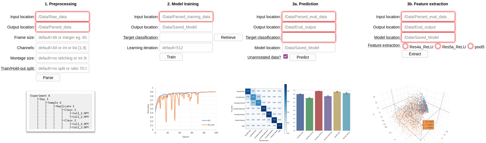

<h1>Deepometry</h1>

Deep learning-based image classification and featurization for imaging (flow) cytometry.

This workflow was originally built for imaging flow cytometry data but can be readily adapted for microscopic images of isolated single objects. The modified implementation of ResNet50 allows researchers to use any image frame size and any number of color channels.

<h2>Installation</h2>

A full installation guide can be found [**here**](https://www.evernote.com/shard/s730/sh/f60a69be-cb67-45f7-8054-c71035478b5e/5d7ca2a094dd33a599ef57715403cead). Briefly, the following dependencies are needed:
- Python 3.6
- Tensorflow-gpu 1.9.0
- Keras 2.1.5
- Numpy 1.18.1
- Scipy 1.4.1
- Keras-resnet 0.0.7
- Java JDK 8.0 or 11.0
- Python-bioformats 1.5.2

Once the above dependencies are installed, clone this ``Deepometry`` repository by :

    git clone https://github.com/broadinstitute/deepometry.git
    cd deepometry
    pip install .

**Use**
------
Execute ``Deepometry`` functions through any of the following interfaces:

CLI
------

Switch to [CLI](https://github.com/broadinstitute/deepometry/tree/CLI) branch:

    git checkout CLI

Display a list of available subcommands:

    deepometry --help

To display subcommand use and options:

    deepometry SUBCOMMAND --help

IPYNB
------

Switch to [IPYNB](https://github.com/broadinstitute/deepometry/tree/IPYNB) branch:

    git checkout IPYNB

Use these [Jupyter notebooks](https://github.com/broadinstitute/deepometry/tree/IPYNB).

GUI (recommended)
------

Switch to [GUI](https://github.com/broadinstitute/deepometry/tree/GUI) branch:
    
    git checkout GUI

    python Deepometry_GUI.py

Open a web-browser, navigate to **http://localhost:5000/** or **http://127.0.0.1:5000/**

(this is a local server running on your own device, no data is sent out to the internet)

**<h3>1. Preprocessing</h3>**

Transform single-cell image data from .TIF, .CIF (gated populations exported from [IDEAS software](https://www.luminexcorp.com/imaging-flow-cytometry/)) to Numpy arrays (.NPY).

Essential user inputs:
- *Input location*: choose the folder that contains original image inputs. **Note**: it is highly recommended to tag and structure the input folder into hierarchical sub-folders with metadata prefixes such as *Experiment ...*, *Day ...*, *Sample ...*, *Replicate ...* , *Class ...*
- *Output location*: location to store the parsed numpy arrays. Sub-folders will be automatically created to mirror input folder structure.
- *Frame size*: set the width/height size of the (width × height × channel) tensor. If user sets a size bigger than the original images, each of the images will be padded with its own background. If user sets a size smaller than the original images, each of the images will be cropped toward its center.
- *Channels*: choose the channel(s) imaged by the instrument (e.g. image flow cytometer, fluorescent microscopy). Use square brackets [ ] for multiple channels, e.g. [0,6,3,4]. If a single channel is desired, input an integer **without** bracket.
- *Montage size* (optional): use this option to generate per-channel tiled (stitched) montages, which can be efficiently used for [CellProfiler](http://cellprofiler.org/imagingflowcytometry/). Leave blank for no stitching.
- *Train/Hold-out split* (optional): Input a ratio to split the parsed data into Training and Hold-out Cross-Validation subsets. Data will be randomly shuffled before splitting into subfolders "Train", "Hold-out" respectively. Training set can be used in "Step 2. Model Training", and Hold-out set can be used in "Step 3a. Prediction" to evaluate the model performance. Leave blank for no splitting.

**<h3>2. Model training</h3>**

Train a ResNet model using Tensorflow backend.

Essential user inputs:
- *Input location*: choose the folder that contains parsed numpy arrays (from step 1).
- *Output location*: location to store the trained model.
- *Target classification*: choose the target categories to train the classifier, e.g. choose "Samples" to instruct the model to learn to categorize Sample A, Sample B, Sample C; choose "Classes" to train the model to distinguish "Class Control_cells", "Class Treated_cells" etc. If this dropdown menu appears empty, retrieve the list of possible targets by specifying input location.
- *Learning iteration*: the number of *epochs* for a deep learning training session. By default it is set to 512, which might take several days (depends on the size of the training materials and available hardware, especially GPUs).
- More (hyper)parameters for model training can be set at [model.fit](https://github.com/broadinstitute/deepometry/blob/6f41345f4ddff1cdb2acdfba427274ee03e865f1/deepometry/model.py#L106).

**<h3>3a. Prediction</h3>**

Evaluate a trained model using annotated data, or predict labels on unknown/unannotated data.

Essential user inputs:
- *Input location*: choose the folder that contains parsed numpy arrays (from step 1).
- *Output location*: location to store the evaluation outcomes.
- *Target classification*: choose the target categories to test the classifier. If this drop-down menu appears empty, retrieve information from **Training input location**. It is crucial to retrieve the list of possible classficiation targets from **the model training session** to ensure the correct reconstruction of categorization, since the training materials should contain all the categories the model has been exposed to. E.g. there could be a situation that one or some categories are missing in a testing dataset.
- *Model location* (optional): location of the saved model. Input either a folder location or an exact .h5 or .hdf5 file. If the provided folder location contains more than one model, the latest .h5 or .hdf5 will be loaded. If no folder location is provided, the checkpoint.hdf5 (in deepometry/data/) will be used.
- *Unannotated data?*: Tick this box to perform label prediction on unknown (unannotated) test data

**<h3>3b. Feature extraction</h3>**

Use a trained model to extract deep learning feature embeddings of unclassified objects (eg. as in weakly supervised learning).

Essential user inputs:
- *Input location*: choose the folder that contains parsed numpy arrays (from step 1).
- *Output location*: location to store the extracted features and associated metadata.
- *Model location* (**required**): location of the saved model. Input either a folder location or an exact .h5 or .hdf5 file. If the provided folder location contains more than one model, the latest .h5 or .hdf5 will be loaded. *Note*: it is **critical** that the model name contains the numeric identifier of how many categories the model was trained to classify. Please check whether such a file exists after model training, eg. "model_7-class_categories.h5".
- *Feature extraction*: use Res4a_ReLU, Res5a_ReLU or pool5 layer of the ResNet50 architecture as feature extractor. In general, the deeper the layer is, the more specified the features are captured, with regard to the assigned tasks. For example, if the task and the ultimate goal are both to distinguish different phenotypes of the cells, pool5 layer will more likely capture morphological features that are specific signatures of the phenotypes. In another example, if the task was to classify the date of the experiment, but the actual biological question was to group cells into clusters of morphological similarity, then users would want to use Res4a_ReLU and Res5a_ReLU to preserve the generic features of the cells.

Once feature extraction is done, the output files, i.e. features_extracted_by_pool5.txt, metadata.tsv can be uploaded to http://projector.tensorflow.org for 2D/3D PCA, t-SNE, and UMAP visualization of deep learning embeddings. Example:

**<h2>Publications</h2>**

Doan M, Sebastian JA, Caicedo JC, et al. [Objective assessment of stored blood quality by deep learning](https://www.pnas.org/content/117/35/21381). Proc Natl Acad Sci U S A. 2020;117(35):21381-21390. doi:10.1073/pnas.2001227117

Doan M, Case M, Masic D, et al. [Label-Free Leukemia Monitoring by Computer Vision](https://pubmed.ncbi.nlm.nih.gov/32091180/). Cytometry A. 2020;97(4):407-414. doi:10.1002/cyto.a.23987